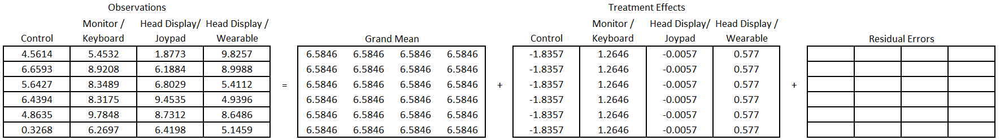

```{r setup, include=FALSE}
knitr::opts_chunk$set(echo = TRUE)

library(knitr)
library(tidyverse)
library(kableExtra)
```

------------------------------------------------------------------------

The experimental designs in this section have 2 key characteristics in common:

-   Conditions are assigned to subjects (a.k.a. experimental units) completely at random
-   The way error is accounted for in all these designs and the way the requirements are checked can be approached the same way

To assign something **completely at random** means that each experimental unit has a known and equal chance of being selected for a particular treatment and that no other considerations are taken into account when making treatment assignments. Usually, for balance, the same number of units are assigned to each treatment. For example, if I have 4 treatment and 16 units, I may use a computer to randomly shuffle the units into treatment groups.

Factorial experiments involve two or more factors that are crossed. **Factorial crossing** means that each combination of factor levels is considered as a treatment in the study. (A study with just one factor is not technically a factorial design, but we will lump it in with our discussion of factorial experiments her because of the completely random treatment assignment).

Contrast a factorial design with the one-at-a-time approach. In a one-at-a-time approach, if I had two factors I wanted to study I would run two separate experiments to evaluate the effect of each factor on the response one-at-time. Factorial designs have a couple of major advantages over one-factor-at-a-time studies.

1.  They are a more efficient use of our time and material: I can get information about both of my factors from just one experimental unit
2.  Perhaps most importantly, factorial designs allow the researcher to estimate interaction effects. Or in other words, we can observe how one factor's effect on the response variable changes for different levels of the other factor.

EXAMPLE of BF2???

In summary, "factorial" refers to how you determine which treatments will be included in the study, and "completely randomized" refers to how treatments are assigned to subjects.

------------------------------------------------------------------------

## BF\[1\] {.tabset .tabset-fade .tabset-pills}

A study with just one factor

### Overview

In a basic one-way factorial design (BF\[1\]), only one factor is purposefully varied. Each level of the factor is considered a treatment. Each experimental unit is randomly assigned to exactly one treatment.

#### Factor structure

The factor structure for the model resulting from a completely randomized, one factor with design is:


The above diagram illustrates a factor with 4 levels, 6 replications at each level.

#### Hypotheses and model

A more detailed description of the model for an ANOVA with just one factor:

$$
y_{ij} = \mu + \alpha_i + \epsilon_{ij}
$$

$y_{ij}$: the $j^{th}$ observation from treatment $i$

$\mu$: the grand mean of the dataset. Also referred to as an overall mean or benchmark.

$\alpha_i$: effect of treatment $i$

$\epsilon_{ik}$: the error term, or residual term of the model. There are *j* replicates for each treatment. It represents the distance from an observation to its treatment mean (or predicted value).

The null and alternative hypotheses can be expressed as:

$$
H_o: \alpha_1 = \alpha_2 = ... = 0
$$ $$
H_a: \alpha_i \neq 0 \quad \text{for at least one }\ \alpha_i
$$

#### Assumptions

A one-way ANOVA model may be used to analyze data from a BF\[1\] design if the following requirements are satisfied:

1)  Each experimental unit is randomly assigned to only 1 treatment (or factor level)
2)  The error term of the model ($\epsilon_{ik}$) is normally distributed. This assumption is met when the residuals are normally distributed (as seen in a qq-plot).
3)  The population variance of each group is equal. This is often called the homogeneity of variance, or constant variance assumption. This is considered met when each group of residuals in the residual vs. fitted-values plot shows a similar vertical spread.

------------------------------------------------------------------------

### Design

In a one factor design, one factor is purposefully varied and all other factors are controlled in order to isolate the effect of just the factor under study. Each level of the factor is considered a treatment.

In a completely randomized design, each experimental unit is randomly assigned to exactly 1 treatment. It is common to keep the number of units assigned to each treatment the same to ensure balance. This can be done by listing all the subjects, then listing the treatments, as seen below:

|  Subject  | Treatment | Order |
|:---------:|:---------:|:-----:|
| Subject 1 |     A     |   1   |
| Subject 2 |     A     |   2   |
| Subject 3 |     B     |   3   |
| Subject 4 |     B     |   4   |
| Subject 5 |     C     |   5   |
| Subject 6 |     C     |   6   |

Then you randomly shuffle the treatment column. (You should also be paying attention to the order in which subjects and treatments are being experimented on as this could be a potential source of bias. In a BF\[1\], you randomize the order also.) The result might look something like this.

|  Subject  | Treatment | Order |
|:---------:|:---------:|:-----:|
| Subject 1 |     A     |   4   |
| Subject 2 |     B     |   3   |
| Subject 3 |     C     |   6   |
| Subject 4 |     C     |   5   |
| Subject 5 |     A     |   1   |
| Subject 6 |     B     |   2   |

You may notice in the above example that, even with randomization, treatment C occurs in the last 2 observations. If we were truly concerned about the order we could be more strategic and implement a *blocked design* to prevent "unlucky" ordering and pairing.

Consider the following example. An experiment was done to asses different modes of virtual training in how to launch a lifeboat. Sixteen students in the maritime safety training institute were a part of the study, and each of the students were assigned one of four possible virtual training experiences. The four experiences included: Lecture/Materials (Control) (1), Monitor/Keyboard (2), Head Monitor Display/Joypad (3), and Head Monitor Display/Wearables (4). The response variable was the student's performance on a procedural knowledge assessment (performance is defined as their level of improvement from pre to post test).

To obtain a balanced design, we will want each treatment to be assigned to four students. We could get 16 pieces of paper and write "Treatment 1" on 4 pieces, "Treatment 2" on another 4 pieces, and so on until each treatment has 4 pieces of paper. We could then put them in a hat, mix them up and then randomly draw out a piece of paper to assign it to a subject. Intuitively this makes sense, but writing and cutting paper is slow and inefficient. We could implement a similar process in R to assign treatments.

First, we list all the possible treatments, and repeat that listing until it is the same size as our count of subjects. (Note, if your number of subjects is not an exact multiple of the number of treatments, you may need to decide which treatments deserve fewer observations)

```{r}
treatment_list <- rep(1:4,4) #This repeats the sequence of 1 to 4, four times
treatment_list
```

Here it is reformatted in a easy to read table.

|  Subject   | Treatment |
|:----------:|:---------:|
| Subject 1  |     1     |
| Subject 2  |     2     |
| Subject 3  |     3     |
| Subject 4  |     4     |
| Subject 5  |     1     |
| Subject 6  |     2     |
| Subject 7  |     3     |
| Subject 8  |     4     |
| Subject 9  |     1     |
| Subject 10 |     2     |
| Subject 11 |     3     |
| Subject 12 |     4     |
| Subject 13 |     1     |
| Subject 14 |     2     |
| Subject 15 |     3     |
| Subject 16 |     4     |

Then we randomly shuffle treatments with subjects to get the following assignments. The R code could look like this

```{r}
set.seed(17) #only use this if you want the exact same random selection as this example
sample(treatment_list, 16)
```

We can see here that subject 1 should get treatment 2. Subject 2 gets treatment 4, Subject 3 gets treatment 1 and so on.

|  Subject   | Treatment |
|:----------:|:---------:|
| Subject 1  |     2     |
| Subject 2  |     4     |
| Subject 3  |     1     |
| Subject 4  |     4     |
| Subject 5  |     3     |
| Subject 6  |     1     |
| Subject 7  |     3     |
| Subject 8  |     2     |
| Subject 9  |     2     |
| Subject 10 |     2     |
| Subject 11 |     4     |
| Subject 12 |     3     |
| Subject 13 |     4     |
| Subject 14 |     1     |
| Subject 15 |     3     |
| Subject 16 |     1     |

------------------------------------------------------------------------

### Decomposition and Factor Structure

This section serves as a bridge between the design and the analysis of an experiment. It is equivalent to doing the analysis by hand. The primary goal is to see how the design decisions impact the analysis; including a deeper understanding of what the numbers in an ANOVA table mean and how they are calculated.

A factor structure for an experimental design can help provide an effective way to organize and plan for the type of data needed for an experiment. For a basic one-way factorial design, three factors are involved for the experiment: the benchmark (or grand mean), the treatment, and the residual error. For example, an experiment was done to help train people in the procedure to launch a lifeboat. This was a Basic One-way Factorial Design, one where the treatments included: Lecture/Materials (Control) (1), Monitor/Keyboard (2), Head Monitor Display/Joypad (3), and Head Monitor Display/Wearables (4). The students were then given a pre-test before training and a post-test after training and the difference between the two scores was the measurement used from each student in the analysis. Therefore, we have four levels for the treatment with six replicates for each treatment (the actual study used 16 observations per treatment). The diagram below gives the factor structure of the design, and the accompanying mathematical model.


A basic one-way factorial design has three factors: the benchmark, treatment, and residual. The effects of these factors can be summed together to find each observed value.

-   The **observed values** on the left show that there are 24 distinct observations of performance score, represented by the 24 cells - one for each of the observed values.
-   The **benchmark** represents the grand mean (or overall mean). The single large cell indicates that there is only one grand mean and it is part of every observation.\
-   The **treatment factor** involves the four levels of the treatment represented by the four vertically long cells. Each treatment may have a distinct mean (or effect).
-   The **residual error** represents the difference between the observed value and the predicted value. The predicted value, also called the fitted value, is the sum of the grand mean and treatment effect. Each of the cells represent a distinct value for the residual error.

#### Inside vs. Outside Factors

Having a factor structure can help us determine the **degrees of freedom** and the **effects** of each factor. Before determining the degrees of freedom and the effects of each factor, understanding **outside and inside factors** is helpful.

A factor is inside of another factor if all the levels of one factor (**the inside factor**) completely fits within a second factor (**the outside factor**).

You may find this analogy helpful. Pretend that an outside factor is a box, and the inside factor levels are blocks that fit perfectly within the box.

<center>

 <!--  --> <!-- picture from: https://www.amazon.com/MOD-Complete-Extra-Large-Size/dp/B079J8PB73 -->

</center>

In our basic one-way factorial design there are three factors: the benchmark, treatment, and residuals. In the picture below, benchmark is represented in red, treatment is drawn in blue, and the residual factor levels are depicted in black.


In order to understand the relationship between the benchmark and treatment factor, imagine picking up the levels of factor and placing them in the other factor one at a time. We will start with taking the levels of treatment and placing them inside of the benchmark.


In this picture you can see that one entire level of treatment can fit inside of a single level of benchmark. Even though they may share a boundary line, the level does not cross over and start sharing boundaries with any other level. You can repeat this for the other 3 levels of treatment with the same result. Therefore, we say that treatment is inside of benchmark, which is the same as saying that benchmark is outside of treatment.

Consider now the relationship between treatment and residual. If we take a level of treatment and overlay it on the residual factor, we can see it does not fit neatly inside one of the levels of residual error. In fact, one level of treatment crosses the boundaries of many of the levels of residual error. Therefore, we cannot say that treatment is inside of residual error.


Since treatment is not inside of residual error, does this necessarily mean that treatment is outside of residual error? We can determine this by taking one level of residual at a time and overlaying it on the treatment factor structure, as is pictured below. It can be seen that one level of residual error does NOT cross any of the treatment level boundaries. Therefore, we can safely say that treatment is indeed outside of residual error; or equivalently that treatment is outside of residual error.


To clarify a common misunderstanding, consider an experiment where we are looking at the inside vs. outside relationship of two factors: A, and B.

-   When factor A is inside of factor B, we can also say factor B is outside of factor A.
-   But, when factor A is *not* inside of factor B, this does *not necessarily mean that factor A is outside of factor B*. Later you will come across designs where the two factors are neither outside nor inside of each other: they are crossed.

In summary, inside and outside factors for every basic one-way factorial design:

-   The **benchmark factor** is the outside factor for all the other factors (treatment and residual error)
-   The **treatment factor** is an inside factor to the benchmark factor but an outside factor to the residual error.
-   The **residual error** is an inside factor for all other factors (the benchmark and treatment factors).

#### Degrees of Freedom

We can use our understanding of inside and outside factors to determine the degrees of freedom (df) for the **benchmark**, **treatment**, and **residual errors** factors.

The general formula for degrees of freedom for any factor in a design is:

<center>

> **df = Total levels of a factor minus the sum of the df of all outside factors**

</center>

An alternative method of finding degrees of freedom is to count the number of unique pieces of information in a factor.

Going back to the lifeboat training example (see example above), we have 24 observations total and four levels of the treatment.


For **benchmark**, there is only one level of the factor (shown by the one cell) and there are no outside factors for benchmark. Therefore, the degrees of freedom for benchmark is one. Another way to think of this is that the degrees of freedom represents the number of unique pieces of information contributing to the estimation of the effects for that factor. In this case, as soon as I know the benchmark value (or better stated, as soon as I estimate the benchmark value) for just one of the observations, I know it for all the observations. Therefore, there is just one degree of freedom.

For **treatment**, there are four levels of the factor (shown by the four vertically long cells for treatment). Benchmark is the only factor outside of treatment. Take the number of levels for treatment (4) and subtract the degrees of freedom for benchmark (1), which yields 4-1 = **3 degrees of freedom** for treatment.

We could just as easily have used the other approach to finding the degrees of freedom: counting the unique pieces of information the treatment effects really contains. Since all observations from the same treatment will have the same treatment effect applied, we really only need to know 4 pieces of information: the effect of each treatment. But the answer is actually less than that. Because we know that the effects must all sum to zero, only 3 of the effects are free to vary and the 4th one is constrained to be whatever value will satisfy this mathematical condition. Thus, the degrees of freedom is 3. As soon as we know 3 of the treatment effects, we can fill in the treatment effects for all the observations.

For **residual errors**, there are 24 levels of the factor (as shown by the 24 cells for residual error on the far right of the factor structure diagram). Both benchmark and treatment are outside factors for the residual errors factor. Take the number of levels for the residual error (24) and subtract the sum of the degrees of freedom for benchmark and treatment (3+1=4). The residual error has 24 - (3+1) = **20 degrees of freedom**.

The approach of counting unique pieces of information can be applied here as well. In this case, we use the fact that the treatment effects must sum to zero within each treatment. So within each treatment, 5 of the observations are free to vary, but the 6th will be determined by the fact that their sum must be zero. Five observations multiplied by 4 treatments is 20 observations, or in other words, 20 degrees of freedom.

#### Factor Effects

We can use our understanding of inside vs. outside factors to estimate the effect size for the benchmark, treatment, and residual errors factors. In other words, we can estimate the terms in the one-way ANOVA model.

The general formula for effect size for any factor of a design is:

<center>

> **Effect size = factor level mean minus the sum of the effects of all outside factors**

</center>

To demonstrate this, the lifeboat training study will be used; where each column of data comes from a different training method (a.k.a. treatment).


##### Calculate means

To estimate all the factor effects we must first calculate the mean for the benchmark factor and the means for each treatment level.

For benchmark, get the mean of all 24 observations. The mean for all the observations is 6.5846. There is only one level for benchmark since, all observations come from the same benchmark. Therefore, this number is placed into each of the cells for the benchmark factor.


For the treatment factor, calculate the mean of each of the four levels. To calculate the mean for Control:

$$
\frac{4.5614 + 6.6593 + 5.6427 + 6.4394 + 4.8635 + 0.3268}{6} = 4.7489
$$

You can similarly find the mean for monitor keyboard is 7.8492, the mean for head monitor display/joypad is 6.5789, and the mean for head monitor display/wearables is 7.1616. These numbers will be put in the columns associated with each level of the treatment (see below).


##### Calculate effects

From here we can calculate the effects for benchmark, treatment and residual errors. We will use the general formula for calculating effect size as stated above.

For the benchmark, there is only one level and there are no outside factors. Therefore, the effect due to benchmark is 6.5846 (equivalent to its mean) and this affect is applied to all 24 observations.

For the treatment factor there are four means, one for each level. To calculate this, take the factor level mean and subtract it from the effect due to benchmark to get the effect for each treatment level. For Control, this looks like:

$$
4.789 - 6.5846 = -1.8358
$$

Being in the control group has the effect of *reducing* the student's performance by 1.8358 on average compared to the overall, or grand, mean. In a similar way you can find the effect for Monitor/Keyboard 7.8492 - 6.5846 = 1.2645. This means the student performance scores increased by 1.2645 on average in this condition compared to the overall mean. For Head Monitor Display/Joypad, the effect is -0.0058 (6.5789 - 6.5846). For Head Monitor Display/Wearables, the effect is 0.5770 (7.1616 - 6.5846) (see below).



To calculate the residual error effects we must remember that there are 24 levels of residuals. Therefore, the factor level mean for a residual is simply the observed value itself. This means the residual effect can be calculated by taking an observed value and subtracting the effects for benchmark and the effect for the treatment that particular observation received. For instance, for the observation located in the top left of our dataset the observed value is 4.5614. Subtract the sum of the effects of outside factors (benchmark and treatment). This observation was from the control group so we get:

$$
4.5614 - (6.5846 + -1.8358) = -0.1875
$$

The value for the top left cell in residual errors effects is -0.1875. This means the observed value of 4.5614 was lower than we would have expected it to be. In other words, the performance score of 4.5614 was -0.1875 less than the average for all observations in the control group. In context of the this study, this individual's performance was lower than his/her peers who received the same type of training.

We can repeat the calculation for the first residual in the second column. Take the observed value (5.4532) and subtract the sum of the effect due to benchmark and its respective treatment (in this case monitor/keyboard). The residual is

$$
5.4523 - (6.5846 + 1.2645) = -2.3960
$$

Repeat this process for all the remaining 22 residual values. The result is shown in the table below on the right.


#### Completing the ANOVA table

Now that we have calculated degrees of freedom and effects for each factor in a basic one-way factorial design, we can calculate the remaining pieces of the ANOVA table: **Sum of Squares (SS), Mean Squares (MS), F-statistic and p-value**. An ANOVA table essentially steps through the variance calculation that is needed to calculate the F statistics of an ANOVA test. In other words, a completed ANOVA table enables us to conduct a hypothesis test of the significance of the treatment.

In an ANOVA table, each factor and their associated degrees of freedom are listed on the left. Note: the total degrees of freedom are the total number of observations.

```{r echo = FALSE}
Source <- c("Benchmark", "Treatment", "Residual Error", "Total")
df <- c(1,3,20,24)
SS <- rep("", 4)
MS <- rep("", 4)
Fvalue <- rep("", 4)
pvalue <- rep("", 4)

mydf <- data.frame(Source, df, SS, MS, Fvalue, pvalue)
kable(mydf, format = "html", table.attr = "style='width:65%;'")%>% 
  kableExtra::kable_styling()

```

To get the **sum of squares (SS)** for a factor, for each observation the effect for that factor needs to be squared. Then all the squared values are summed up to get the sum of squares.

For **benchmark**, the effect of 6.5845 is listed 24 times, once for each observation. The value of 6.5845 will be squared. This squaring will be done 24 times and the squared values will then be added together to get the sum of squares due to benchmark.

$$
SS_\text{Benchmark} = (6.5845)^2 + (6.5845)^2 + ... + (6.5845)^2 = 24*(6.5845)^2 = 1040.57
$$

<br>

The **treatment factor** has four different effects, one for each level of the factor. For each effect, the value is squared and then multiplied by the number of observations within the level of the factor. Then, the results are added across all levels to get the sum of squares due to treatment. For instance, for the control group, the effect is -1.8358. The value is then squared, and then multiplied by six due to the six observations within the control group. This is done for the other three levels as well and then the resulting values from the four levels are added.

$$
SS_\text{Treatment} = 6*(-1.8358)^2 + 6*(1.2645)^2 + 6*(-0.0058)^2 + 6*(0.5770)^2 = 31.81
$$ <br>

The effect for the **residual error factor** has 24 unique values. Each of those residuals are squared and then the squared values are summed together.

$$
SS_\text{Residuals} = (-0.1875)^2 + (1.9105)^2 + (0.8939)^2 + (1.6906)^2 + ... + (-2.0157)^2 = 100.49
$$ <br>

To get the **total sum of squares**, we can either square all the observations and then add the squared values,

$$
SS_\text{Total} = (4.5614)^2 + (6.6593)^2 + (5.6427)^2 + (6.4394)^2 + ... + (5.1459)^2 = 1172.87
$$

**-OR-** we can get the same result if we add together the sum of squares for the benchmark, treatment, and residual error factors.

$$
SS_\text{Total} = 1040.57 + 31.81 + 100.49 = 1172.87
$$

<br> <br>

```{r echo = FALSE}
#Replace the blanks with numbers in the SS column
Source <- c("Benchmark", "Treatment", "Residual Error", "Total")
df <- c(1,3,20,24)
SS <- c(1040.57, 31.81, 100.49, 1172.87)
MS <- rep("", 4)
Fvalue <- rep("", 4)
pvalue <- rep("", 4)

mydf <- data.frame(Source, df, SS, MS, Fvalue, pvalue)
kable(mydf, format = "html", table.attr = "style='width:65%;'")%>%
  kableExtra::kable_styling()
```

We can now calculate the mean squared error column, or **mean square (MS)**. This mean is calculated by dividing sum of squares by the number of unique pieces of information that make up the factor. In this way we convert a total into an average; or in other words we change a sum into a mean. The mean squared error is the same as a variance. (The Root Mean Squared Error is equivalent to a standard deviation).

The purpose of the ANOVA table is to partition or break apart the variability in the dataset to its component pieces. We can then see more clearly which factor is the a bigger source of variability.

The mean square calculations are:

$$
MS_\text{Benchmark} = \frac{SS_\text{Benchmark}}{df_\text{Benchmark}} = \frac{1040.57}{1} = 1040.57
$$

<br>

$$
MS_\text{Treatment} = \frac{SS_\text{Treatment}}{df_\text{Treatment}} = \frac{31.81}{3} = 10.60
$$

<br>

$$
MS_\text{Residual Error} = \frac{SS_\text{Residual Error}}{df_\text{Residual Error}} = \frac{100.49}{20} = 5.02
$$

<br>

```{r echo = FALSE}
#Replace the blanks with numbers in the SS column
MS <- c(1040.57, 10.60, 5.02, NA)

mydf <- data.frame(Source, df, SS, MS, Fvalue, pvalue)

options(knitr.kable.NA = '')
kable(mydf, format = "html", table.attr = "style='width:65%;'")%>% 
  kableExtra::kable_styling()
```

When getting an **F test statistic**, testing for the treatment factor is the primary factor of interest so only the F test statistic for treatment is calculated for the analysis. To get the F test statistic for treatment, take the mean square (MS) due to treatment and divide by the mean square (MS) due to the residual error. Since the mean square error is equivalent to a variance, you can think of this as calculating the variance in treatment effect sizes in the numerator and the variance of the distances for an observed value to its respective treatment mean in the denominator. Simply put, it is the between groups variance divided by the within group variance.

$$
F_\text{Treatment} = \frac{MS_\text{Treatment}}{MS_\text{Residual Error}} = \frac{10.6}{5.02} = 2.11
$$

<br>

To complete the ANOVA, table, the **p-value for treatment** is calculated based on the F statistic for treatment and the degrees of freedom for both Treatment and Residual Error. In practice, you would not compute this by hand, but in order to complete the decomposition of variance in a manual way, we will calculate the p-value in R using the `pf()` function: `1 - pf(test statistic, df of Treatment, df of Residual error)`.

In this example, we get

```{r echo = TRUE}
1 - pf(2.11, 3, 20)
```

This p-value, 0.1310, is greater than a typical level of significance (0.05), so we would fail to reject the null hypothesis that all the effects due to treatment are equal to zero. Meaning, we have insufficient evidence to say that any of the training methods had an impact on procedural knowledge test scores regarding launching a life boat.

```{r echo = FALSE}
#Replace the blanks with numbers in the SS column
Fvalue = c(NA, 2.11, NA, NA)
pvalue = c(NA, 0.1310, NA, NA)

mydf <- data.frame(Source, df, SS, MS, Fvalue, pvalue)

options(knitr.kable.NA = '')
kable(mydf, format = "html", table.attr = "style='width:65%;'")%>% 
  kableExtra::kable_styling()
```

------------------------------------------------------------------------

### R Instructions

**The following stuff would belong in the R code pages instead of here**

#### Numerical Summaries

In the following explanations

-   Y must be a "numeric" vector of the quantitative response variable.
-   X is a qualitative variable (should have class(X) equal to factor or character. If it does not, use as.factor(X) inside the aov(Y \~ as.factor(X),...) command.
-   YourDataSet is the name of your data set.

You can take a tidyverse approach or a mosaic package approach to calculating numerical summaries.

mosaic package:

```{r eval = FALSE, echo = TRUE}
library(mosaic)
library(pander)
favstats(Y~X, data=YourDataSet)
```

tidyverse approach:

```{r eval = FALSE, echo = TRUE}
library(tidyverse)
YourDataSet %>%
  Group_by(X) %>%
  Summarise(MeanY = mean(Y), sdY = sd(Y), sampleSize = n()) 
```

#### Graphical Summaries

To obtain a boxplot:

`boxplot(Y~X, data = YourDataSet)`

**Example Code:**

<!-- <a href="javascript:showhide('boxplot')"> -->

<!-- <div class="hoverchunk"> -->

<!-- <span class="tooltipr"> -->

<!-- boxplot() -->

<!-- To obtain a dot plot with a line connecting the treatment means: -->

<!-- `xyplot(Y~X, data=YourDataSet, type=c("p","a"), main=”Whatever title you want”, col=”whatever color you want”, xlab=”whatever x-axis label you want”, ylab=”whatever y-axis label you want”)` -->

------------------------------------------------------------------------

### Resources

#### Examples

[Lifeboat launch training](examples/VirtualTrain.html)

[Mosquito](examples/mosquito.html)

#### Links to outside resources

Populate this section yourself with links to good examples, definitions, other sections within this textbook, or anything else you think will be interesting/helpful.

------------------------------------------------------------------------

## BF\[2\] {.tabset .tabset-fade .tabset-pills}

A study with exactly two factors used to predict a continuous response variable.

### Overview

Lorem Ipsum Overview

#### Hypotheses and model

Here we would list the model in equation form along with the hypotheses we would want to test

#### Assumptions

A quick recount of the assumptions associated with the model. If this gets too repetitive maybe we could take it out and put it under broad topics

#### Factor structure image

This image would actually probably go at the top somewhere, maybe even by or above the title, as a sort of visual anchor/synopsis as to what this design is all about in terms of its structural factors.

------------------------------------------------------------------------

### Design

This will explain how random assignment is conducted. It may generally be a short section, especially since I already explained about completely random assignment above. However, it could get more in-depth. For example, in blocking you can talk about the different methods for creating blocks, or for Latin Squares there's a lot to describe. For partial fractional factorials it could get interesting, etc.

------------------------------------------------------------------------

### Decomposition

It is what it sounds like: discussion of effect calculation, degree of freedom calculation, and factor structure diagrams. Where do things like **notation** get defined, and concepts like **inside vs. outside factors?** Should those go in the broad topics menu?

------------------------------------------------------------------------

### R Instruction

It is what it sounds like: discussion of effect calculation, degree of freedom calculation, and factor structure diagrams. Where do things like **notation** get defined, and concepts like **inside vs. outside factors?** Should those go in the broad topics menu?

### Resources

#### Examples

Here we could link to a full walk through example of the anlaysis (similar to the Math325 notebook)

#### Links to outside resources

This section the student would populate with links to good examples, definitions, other sections within this textbook, or anything else

------------------------------------------------------------------------

## BF\[3\] {.tabset .tabset-fade .tabset-pills}

A study with exactly three factors used to predict a continuous response variable.

### Overview

Lorem Ipsum Overview

#### Hypotheses and model

Here we would list the model in equation form along with the hypotheses we would want to test

#### Assumptions

A quick recount of the assumptions associated with the model. If this gets too repetitive maybe we could take it out and put it under broad topics

#### Factor structure image

This image would actually probably go at the top somewhere, maybe even by or above the title, as a sort of visual anchor/synopsis as to what this design is all about in terms of its structural factors.

------------------------------------------------------------------------

### Design

This will explain how random assignment is conducted. It may generally be a short section, especially since I already explained about completely random assignment above. However, it could get more in-depth. For example, in blocking you can talk about the different methods for creating blocks, or for Latin Squares there's a lot to describe. For partial fractional factorials it could get interesting, etc.

------------------------------------------------------------------------

### Decomposition

It is what it sounds like: discussion of effect calculation, degree of freedom calculation, and factor structure diagrams. Where do things like **notation** get defined, and concepts like **inside vs. outside factors?** Should those go in the broad topics menu?

------------------------------------------------------------------------

### R Instruction

It is what it sounds like: discussion of effect calculation, degree of freedom calculation, and factor structure diagrams. Where do things like **notation** get defined, and concepts like **inside vs. outside factors?** Should those go in the broad topics menu?

### Resources

#### Examples

Here we could link to a full walk through example of the anlaysis (similar to the Math325 notebook)

#### Links to outside resources

This section the student would populate with links to good examples, definitions, other sections within this textbook, or anything else

------------------------------------------------------------------------

## Fractional Factorial Designs {.tabset .tabset-fade .tabset-pills}

This would probably not follow a similar structure as other sections

### Overview??

Lorem Ipsum Overview

------------------------------------------------------------------------

### How many treatments, design rank

Here we would list the model in equation form along with the hypotheses we would want to test

------------------------------------------------------------------------

### Confounding and a Generating Function

A quick recount of the assumptions associated with the model. If this gets too repetitive maybe we could take it out and put it under broad topics

------------------------------------------------------------------------

### Anything else??

------------------------------------------------------------------------

### Additional resources and links

#### Examples

Here we could link to a full walk through example of the anlaysis (similar to the Math325 notebook)

#### Links to outside resources

This section the student would populate with links to good examples, definitions, other sections within this textbook, or anything else

------------------------------------------------------------------------

The decompositions presented in this book are all for balanced designs. Unbalanced designs (where not all treatments have an equal number of observations) use more complicated formulas, but a similar approach/process of decomposition is used.
